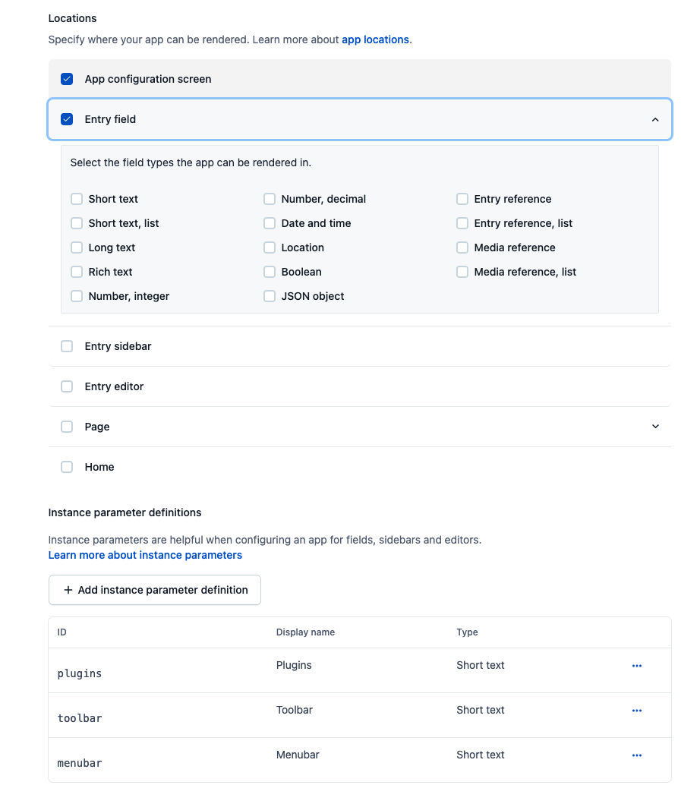

This project was bootstrapped with [Create Contentful App](https://github.com/contentful/create-contentful-app).

## Introduction

This is TinyMCE editor for Contentful App. 
You can write a content with customizable editor interface.

## How to use

### In Contentful Organization
1. Go to Organision's App config page.
2. Create a new App
3. Check `App configuration screen` and `Entry field` in Locations
4. Define Instance parameter as `plugins`, `toolbar` and `menubar`
5. Install it to your space

### In your local
1. Clone the repository
2. `cd ~/app_repository`
3. `npm install`
4. `npm run build`
5. `npm run upload`
    - Or you can upload `dist` to a hosting service like Cloudflare Pages.

### In your Contentful Space
1. Go to Content model definition
2. Select JSON object field type
3. Select your TinyMCE app in Appearance tab
4. Input paramters(`plugins`, `toolbar` and `menubar`)

Now all set!
You can start using TInyMCE Editor in Contentful.

## Note
- TinyMCE account and its API key required
